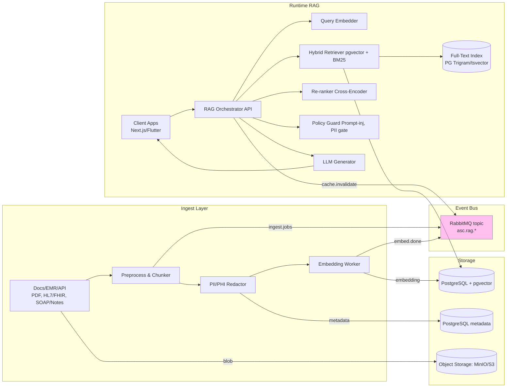

```mermaid
flowchart LR
  subgraph Ingest Layer
    A[Docs/EMR/API\nPDF, HL7/FHIR, SOAP/Notes] --> B[Preprocess & Chunker]
    B --> C[PII/PHI Redactor]
    C --> D[Embedding Worker]
  end

  subgraph Storage
    D -->|embedding| E[(PostgreSQL + pgvector)]
    C -->|metadata| F[(PostgreSQL metadata)]
    A -->|blob| G[(Object Storage: MinIO/S3)]
  end

  subgraph Runtime RAG
    H[Client Apps\nNext.js/Flutter] --> I[RAG Orchestrator API]
    I --> J[Query Embedder]
    I --> K[Hybrid Retriever pgvector + BM25]
    K --> E
    K --> L[(Full-Text Index\nPG Trigram/tsvector)]
    I --> M[Re-ranker Cross-Encoder]
    I --> N[Policy Guard Prompt-inj, PII gate]
    I --> O[LLM Generator]
    O --> H
  end

  subgraph Event Bus
    P[RabbitMQ topic\nasc.rag.*]:::mq
    B -->|ingest.jobs| P
    D -->|embed.done| P
    I -->|cache.invalidate| P
  end

  classDef mq fill:#f7f7,stroke:#888,stroke-width:1px
```